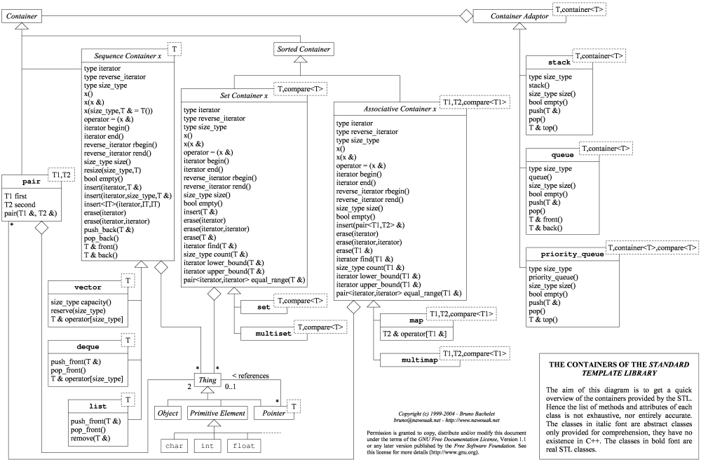

# containers

В рамках данного проекта вам будет предложено написать собственную библиотеку, реализующую основные стандартные контейнерные классы языка С++: `list` (список), `map` (словарь), `queue` (очередь), `set` (множество), `stack` (стек) и `vector` (вектор). Реализации должны предоставлять весь набор стандартных методов и атрибутов для работы с элементами, проверкой заполненности контейнера и итерирования. В качестве дополнительного задания предлагается реализовать еще несколько не так часто используемых, но отличающихся деталями реализации контейнерных классов из контейнерной библиотеки C++.

### Information

Для большинства людей слово контейнер интуитивно понятно и происходит из англоязычного слова contain - "хранить". Так и в программировании: контейнеры используются для хранения наборов объектов одного типа - элементов. Однако контейнерных классов огромное количество. Это связано с тем, что контейнерные классы различаются организацией хранимых наборов объектов и предоставляемыми методами, для взаимодействия с ними. Так, наприер, списки (`list`) хранят любые объекты, а множества (`set`) - только уникальные. 

Сама необходимость разделять контейнеры, а не использовать для решения различных задач один и тот же, восходит не только к очевидным функциональным различиям. В некоторых случаях эффективнее оказывается использовать списки, например, когда в ходе решения поставленной задачи необходимо часто вставлять элементы в середину контейнера, а если добавление новых элементов производится только в конец, целесообразно использовать очередь.

Каждый вид контейнеров должен предоставить пользователю следующие методы:

- стандартные конструкторы (конструктор по умолчанию, конструктор копирования, конструктор перемещения, конструктор со списком инициализации, см. материалы);

- методы доступа к элементам контейнера (например, осуществление доступа к элементу с индексом i);

- методы проверки наполненности контейнера (например, количество элементов в контейнере, проверка на пустоту контейнера);

- методы изменения контейнера (удаление и добавление новых элементов, очистка контейнера);

- методы для работы с итератором контейнера.

Итераторы обеспечивают доступ к элементам контейнера. Для каждого контейнера конкретный тип итератора будет отличаться. Это связано с различным видом организации наборов объектов в контейнерных классах, а также с фактической реализацией контейнера. Итераторы реализуются в таком виде, чтобы они работали схожим образом с указателем на элемент массива языка Си. Именно такой подход через использование итераторов и позволяет взаимодействовать с любыми контейнерами одинаковым образом. Контейнеры предоставляют через методы `begin()` и `end()` итераторы, которые указывают на первый и следующий после последнего элементы контейнера соответственно.

Над итератором `iter` определены следующие операции:

- `*iter`: получение элемента, на который указывает итератор;

- `++iter`: перемещение итератора вперед для обращения к следующему элементу;

- `--iter`: перемещение итератора назад для обращения к предыдущему элементу;

- `iter1 == iter2`: два итератора равны, если они указывают на один и тот же элемент;

- `iter1 != iter2`: два итератора не равны, если они указывают на разные элементы.

Помимо особой организации объектов и предоставления необходимых методов, реализация контейнерных классов требует шаблонизации объектов. 

Шаблонные классы или шаблоны классов используются, когда необходимо создать класс, зависящий от дополнительных внешних параметров, которые могут быть другими классами или типами данных. Например, если необходимо создать класс списка, то есть потребность в избежании переписывания реализации списка для всех возможных типов элементов. Хотелось бы, написав один класс с параметром, получить сразу несколько конкретных классов списка (списки символов, целых чисел, вещественных, пользовательских типов и т. д.). В C++ контейнеры, вместе с итераторами и некоторыми алгоритмами, входят в стандартную библиотеку шаблонов (STL) именно по этой причине.

Контейнеры подразделяются на два основных типа: последовательные и ассоциативные. Для нахождения элемента в последовательных контейнерах (`list`, `vector`, `array`, `stack`, `queue`), необходимо последовательно просмотреть весь контейнер, в то время как в ассоциативных (`map`, `set`, `multiset`) достаточно обратиться по ассоциированному с значением ключу.

## Chapter III

- Программа должна быть разработана на языке C++ стандарта C++20 с использованием компилятора gcc
- Код программы должен находиться в папке src
- При написании кода необходимо придерживаться Google Style
- Обязательно использовать итераторы
- Классы обязательно должны быть шаблонными
- Подготовить полное покрытие unit-тестами методов контейнерных классов c помощью библиотеки GTest
- Запрещено копирование реализации стандартной библиотеки шаблонов (STL)
- Необходимо соблюсти логику работы стандартной библиотеки шаблонов (STL) (в части проверок, работы с памятью и поведения в нештатных ситуациях)

### Part 1. Реализация библиотеки containers.h

Необходимо реализовать классы библиотеки `containers.h` (спецификации указаны в соответствующих разделах материалов, см. пункт [**Основные контейнеры**](containers_info_rus.md)). \
Список классов: `list` (список), `map` (словарь), `queue` (очередь), `set` (множество), `stack` (стек), `vector` (вектор).
- Оформить решение в виде заголовочного файла `containers.h`, который включает в себя другие заголовочные файлы с реализациями необходимых контейнеров (`list.h`, `map.h` и т.д.)
- Предусмотреть Makefile для тестов написанной библиотеки (с целями clean, test)
- За основу стоит рассматривать классическую реализацию контейнеров, но конечный выбор реализаций остается свободным. За исключением списка - его необходимо реализовывать через структуру списка, а не через массив.

*Подсказка*: Вы можете выделять в базовые классы одинаковую реализацию методов контейнеров. Например, для очереди и стека или для списка и вектора. В качестве *одного из возможных примеров* иерархического построения в материалах представлена UML-диаграмма библиотеки STL. Однако ваша реализация не обязана быть строго привязана к этой UML-диаграмме.

### Part 2. Дополнительно. Реализация библиотеки containersplus.h

Необходимо реализовать функции библиотеки `containersplus.h` (спецификации указаны в соответствующих разделах материалов, см. пункт [**Дополнительные контейнеры**](containers_info_extra_rus.md)). \
Список классов, которые нужно реализовать дополнительно: `array` (массив), `multiset` (мультимножество).
- Оформить решение в виде заголовочного файла `containersplus.h`, который включает в себя другие заголовочные файлы с реализациями необходимых контейнеров (`array.h`, `multiset.h`)
- Предусмотреть Makefile для тестов написанной библиотеки (с целями clean, test)
- За основу стоит рассматривать классическую реализацию контейнеров, но конечный выбор алгоритма остается свободным
